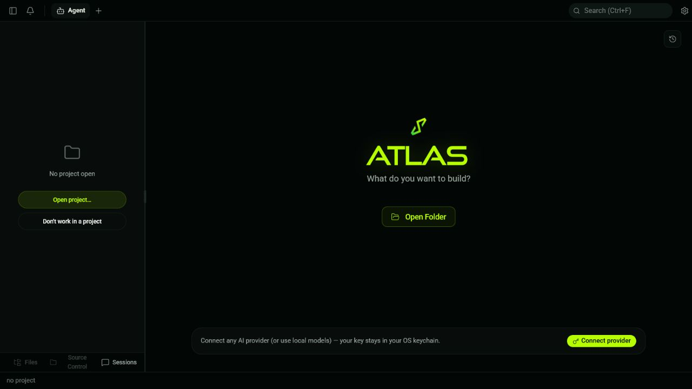
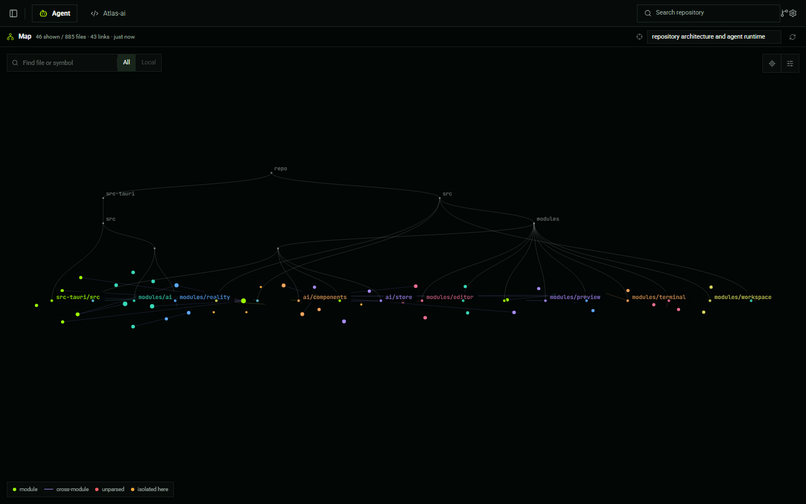

<div align="center">
  

  <h1>Atlas</h1>
  <p><strong>A local-first agentic development workspace that understands, changes, runs, and verifies your repository.</strong></p>

  <p>
    <a href="https://github.com/MDSD0/Atlas-ai/releases/latest"></a>
    <a href="https://github.com/MDSD0/Atlas-ai/releases"></a>
    <a href="https://github.com/MDSD0/Atlas-ai/actions/workflows/ci.yml"></a>
    
    <a href="LICENSE"></a>
  </p>

  <p>
    <a href="https://github.com/MDSD0/Atlas-ai/releases/latest">Download</a>
    ·
    <a href="ROADMAP.md">Roadmap</a>
    ·
    <a href="CONTRIBUTING.md">Contribute</a>
    ·
    <a href="SECURITY.md">Security</a>
  </p>
</div>

Atlas brings a bounded coding agent, native terminal, editor, source control, repository intelligence, web research, and live preview into one fast Tauri desktop app. Projects remain local. Bring an OpenRouter key, another supported provider, or a local model. No Atlas account, hosted repository mirror, or telemetry is required.

## See Atlas

<table>
  <tr>
    <td width="50%" align="center">
      
      <br />
      <sub>Focused start screen with OpenRouter-first setup</sub>
    </td>
    <td width="50%" align="center">
      
      <br />
      <sub>Interactive repository map shared by the user and the agent</sub>
    </td>
  </tr>
</table>

The repository map is not a decorative graph. Atlas builds it from indexed files, symbols, definitions, references, and ranked relationships. You can search it, focus it on a task, inspect neighborhoods, open or attach a file, and ask the agent for architectural role or change impact. The same repository projection is available to agent tools, so the visual map and the agent reason over the same bounded source of truth.

## Why Atlas

### A real agent loop

- Runs a bounded tool loop with explicit budgets, approvals, cancellation, and durable traces.
- Reads, searches, edits, runs commands, manages background processes, researches the web, and inspects live previews.
- Discovers capabilities only when needed through skills, MCP tools, and repository-aware tool search.
- Delegates focused work to observable subagents, with isolated Git worktrees when separation is useful.
- Resumes longer work through plans, checkpoints, work packets, and explicit project memory.

### Repository intelligence the agent can use

- Indexes repository structure with tree-sitter-backed symbols and references.
- Ranks context into a bounded token budget instead of dumping the entire project into a prompt.
- Exposes repository map, context, symbol, and relationship tools directly to the agent.
- Keeps ignored, generated, dependency, binary, and oversized content out of the useful context path.
- Supports task-focused graph projections for architecture discovery and change-impact analysis.

### Reviewable changes and visible proof

- Presents AI edits as file diffs with per-hunk accept and reject controls.
- Serializes same-file mutations and rejects stale edits instead of silently overwriting newer work.
- Records verification plans, command results, diagnostics, and proof receipts.
- Keeps tool calls, subagent activity, approvals, and results inspectable in the session timeline.

### A complete local workspace

- Native PTY terminal with tabs, splits, background streaming, shell integration, and renderer pooling.
- CodeMirror editor with language support, search, Vim mode, image and Markdown previews, and diff review.
- File explorer, source control, commit history graph, staging, commits, push, and worktree workflows.
- Live preview for detected local development servers and external URLs.
- Matte-black acrylic interface with the Atlas lime accent, compact density, and native window behavior.

## Providers

OpenRouter is the default route, with `openai/gpt-5.4-mini` selected for a new setup. Atlas also supports OpenAI, Anthropic, Google, xAI, Cerebras, Groq, DeepSeek, Mistral, Ollama, LM Studio, MLX, and OpenAI-compatible endpoints.

Cloud-provider credentials are stored in the operating-system credential store. Local providers can run without sending prompts to a hosted model.

## Install

Download the newest build from [GitHub Releases](https://github.com/MDSD0/Atlas-ai/releases/latest). Atlas can update itself from the same release channel.

| Platform | Packages |
| --- | --- |
| Windows 10/11 x64 | NSIS setup `.exe` and Windows Installer `.msi` |
| Ubuntu, Debian, and compatible x64 Linux | `.deb` and portable `.AppImage` |
| Fedora, RHEL, and compatible x64 Linux | `.rpm` |
| macOS 13 or newer | Apple Silicon and Intel `.dmg` |

### Platform notes

- Windows installers are not yet publisher-signed. SmartScreen may show an unknown-publisher warning. The planned free signing path is an application to the [SignPath Foundation open-source program](https://signpath.org/projects/).
- macOS builds currently use an ad-hoc signature without Apple notarization, so Gatekeeper may require explicit approval.
- Atlas update manifests and update payloads are cryptographically signed independently of operating-system publisher signing.
- Linux AppImages may require FUSE. If FUSE is unavailable, run the AppImage with `--appimage-extract-and-run`.

## Quick start

1. Install and open Atlas.
2. Open a project folder.
3. Open **Settings**, then **Models**.
4. Add your OpenRouter API key, or configure another cloud or local provider.
5. Give Atlas a concrete task and review approvals and proposed changes as it works.

Atlas reads `ATLAS.md`, `AGENTS.md`, and compatible repository guidance from the workspace. Guidance, memory, and model claims never replace current repository evidence.

## Safety model

Read-only repository inspection stays within the authorized workspace. File mutations, destructive operations, and shell execution use explicit approval boundaries. Secret-like paths are denied at both read and write boundaries. Long-running or background work remains visible and cancellable.

Atlas is preview software. Keep important work in version control and review agent changes before accepting them.

## Build from source

Prerequisites:

- Node.js 22.13 or newer
- pnpm 10
- Rust stable
- [Tauri 2 platform prerequisites](https://v2.tauri.app/start/prerequisites/)

```bash
git clone https://github.com/MDSD0/Atlas-ai.git
cd Atlas-ai
pnpm install --frozen-lockfile
pnpm tauri dev
```

Frontend verification:

```bash
pnpm test
pnpm build
```

Native verification and production packaging:

```bash
cd src-tauri
cargo clippy --locked
cargo test --locked
cd ..
pnpm tauri build
```

## Architecture

Atlas uses React 19, TypeScript, Vite, Tailwind CSS, xterm.js, CodeMirror, Zustand, and the Vercel AI SDK in the webview. Rust and Tauri 2 own filesystem access, PTYs, processes, Git, networking, secure storage, repository indexing, and desktop integration. The webview receives only explicitly registered capabilities through Tauri IPC.

```text
React workspace
  ├─ Agent and subagent UI
  ├─ Editor, terminal, source control, preview
  └─ Repository map and proof surfaces
             │ explicit Tauri commands
Rust desktop core
  ├─ Workspace and secret boundaries
  ├─ PTY, process, file, Git, and web tools
  ├─ Repository index, symbols, ranking, and LSP adapters
  └─ Memory, checkpoints, proofs, and durable traces
```

Read [ATLAS.md](ATLAS.md) for the contributor architecture guide and [CONTRIBUTING.md](CONTRIBUTING.md) before opening a substantial change.

## Project

- [Releases](https://github.com/MDSD0/Atlas-ai/releases)
- [Changelog](CHANGELOG.md)
- [Roadmap](ROADMAP.md)
- [Security policy](SECURITY.md)
- [Code of conduct](CODE_OF_CONDUCT.md)

## Lineage and acknowledgements

Atlas began from the lightweight Tauri terminal foundation of [Terax](https://github.com/crynta/terax-ai), then expanded into a repository-aware agent workspace with a bounded execution loop, shared repository intelligence, reviewable proof, durable memory, worktree subagents, web research, and preview tooling. Terax and its contributors remain credited through the original Apache 2.0 copyright notice in [LICENSE](LICENSE).

Atlas is licensed under the [Apache License 2.0](LICENSE).
